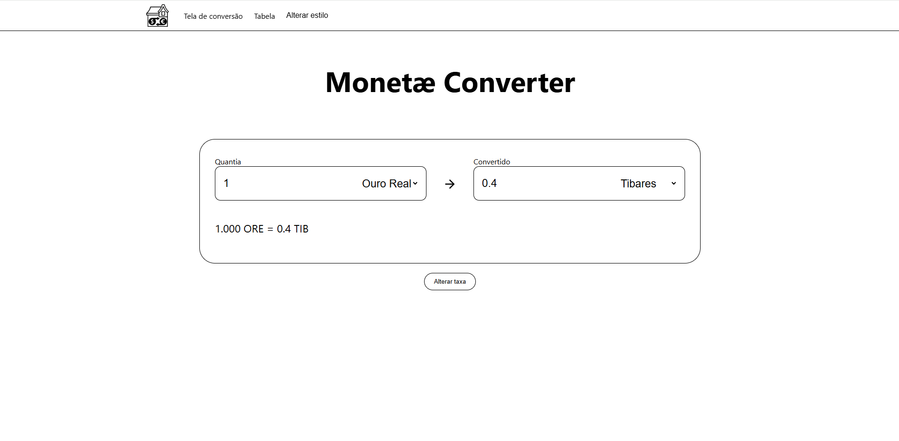
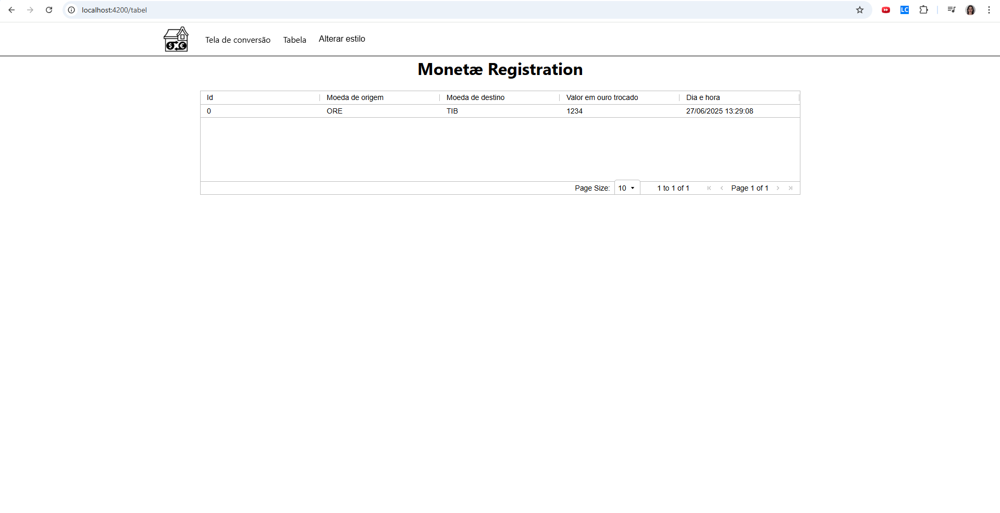

# Casa de Cambio com estilo medieval

Esse projeto é uma casa de cambio com moedas ficticias, feito com angular 19.2, usando gerenciamento de estados e dados mockados.

## Funcionalidades

- **Conversão de moedas**: Permite converter o valor de uma moeda para outra de acordo com uma taxa de cambio editavel.
- **Vizualização de conversão**: Permite a vizualização das conversões feitas durante o uso do programa em uma tabela que requer autentificação.
- **Alteração de tema**: É possivel escolher entre um tema padrão minimalista e um tema inspirado em uma barraca medieval.

## Tecnologias Utilizadas

- **Front-end**: Desenvolvido com Angular, TypeScript, HTML e SCSS.

## Telas




# Desenvolvendo:

Para começar um desenvolvimento local, de git clone nesse repositorio, entre na pasta clonada e rode:

```bash
ng serve
```

Com o servidor rodando, abra o navegador no link `http://localhost:4200/`.

## Building

Para buildar o projeto, rode:

```bash
ng build
```

Esse comando vai compilar o projeto e armazenar a buil no diretorio `dist/`.

## Rodando testes unitario

Para rodar os testes unitario com [Karma](https://karma-runner.github.io) use o seguinte comnado:

```bash
ng test
```
